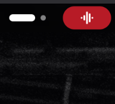
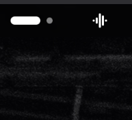
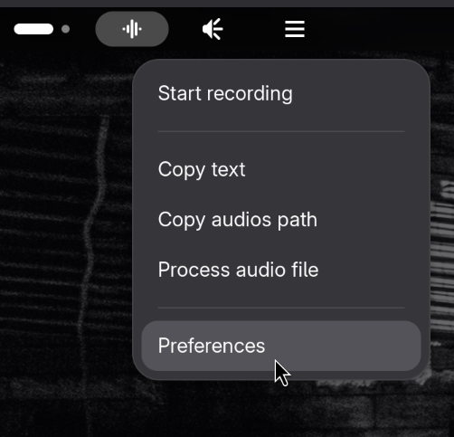
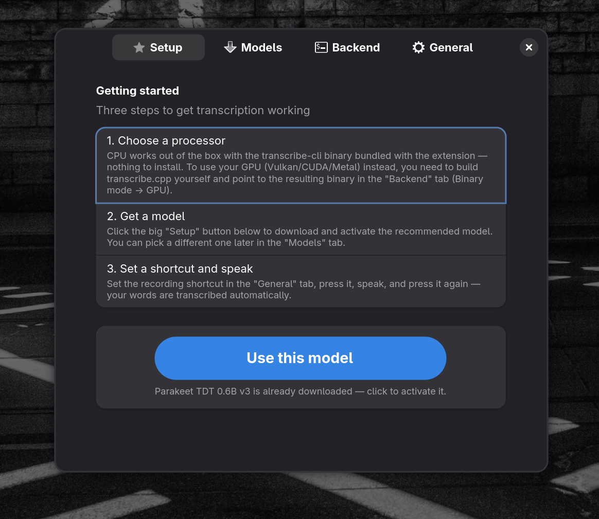
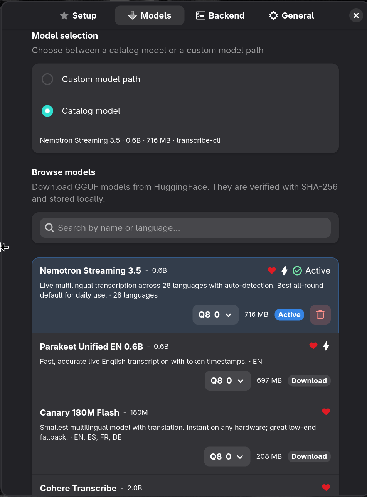
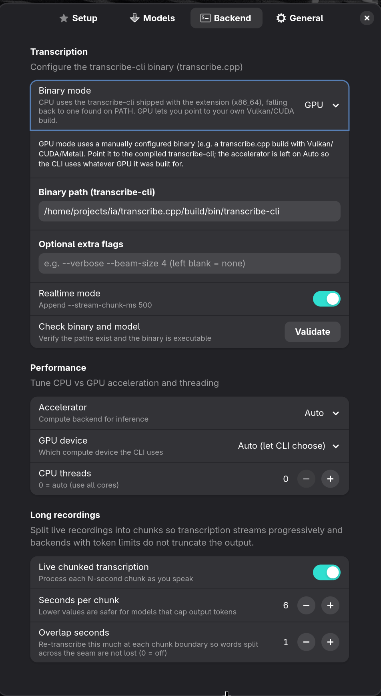
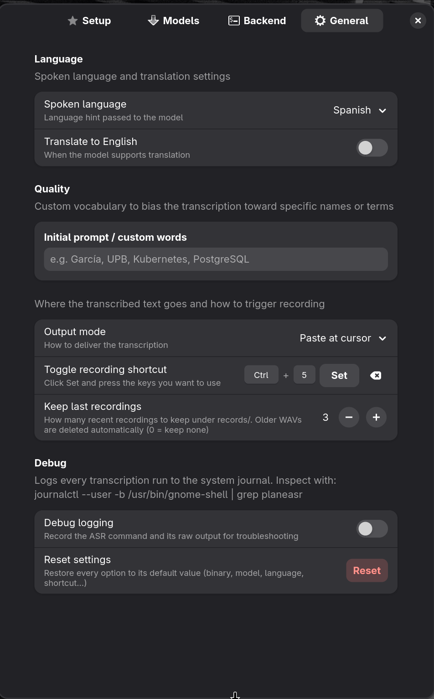

# Plane-ASR

A GNOME Shell extension (`planeasr@wfelipe.com`) for local ASR (speech-to-text),
written in TypeScript and following the official
[TypeScript and LSP](https://gjs.guide/extensions/development/typed.html) guide.
Transcription runs entirely on your machine via `transcribe-cli`
(transcribe.cpp); nothing is sent to the cloud.

 <br>
<br>
<br>
<br>
<br>
<br>

## Features

- **Panel indicator** — left-click toggles record/stop (or cancels a running
  transcription); right-click opens a menu.
- **Global shortcut** — configurable in Preferences to toggle recording (no
  default binding is shipped, per GNOME extension review guidelines on
  clipboard-interacting shortcuts).
- **Output modes** — copy the transcription to the clipboard, or auto-paste it
  at the cursor.
- **Live chunked transcription** — long takes are carved into overlapping
  N-second chunks and transcribed while you speak, so backends with a
  per-call output cap don't truncate and the first words land early.
- **Model catalog** — browse, download (resumable, checksum-verified) and
  select GGUF models from HuggingFace directly in Preferences, or point to a
  custom model path.
- **Process an existing audio file** — pick any audio file; it is converted to
  the required format (ffmpeg / gst-launch-1.0) and transcribed.
- **CPU or GPU** — use a `transcribe-cli` found on your PATH, download the
  CPU-only engine (x86_64) with one click from the "Setup" page (checksum
  verified, not bundled with the extension), or point to your own
  Vulkan/CUDA build; the compute device is chosen from the CLI's own
  `--list-devices`.

## Project structure

```
plane-asr/
├── src/                      # TypeScript sources (modular)
│   ├── ambient.d.ts          # GJS / GNOME Shell ambient type imports
│   ├── extension/            # Runtime code loaded into gnome-shell
│   │   ├── index.ts          #   PlaneAsrExtension (enable/disable lifecycle)
│   │   ├── indicator.ts      #   Panel indicator UI + menu
│   │   ├── asr-service.ts    #   Record → transcribe → output state machine
│   │   ├── asr-backends.ts   #   transcribe-cli argv builder + arg tokenizer
│   │   ├── recorder.ts       #   WAV capture (pw-record / parecord)
│   │   ├── transcriber.ts    #   Runs the ASR CLI subprocess
│   │   ├── audio-chunker.ts  #   Live WAV chunk slicing
│   │   ├── audio-converter.ts#   ffmpeg / gst format conversion
│   │   ├── device-lister.ts  #   `--list-devices` probe
│   │   ├── cli-resolver.ts   #   Locate the CPU/GPU binary
│   │   └── file-chooser-portal.ts # XDG FileChooser portal (D-Bus, no subprocess)
│   ├── prefs/                # Adwaita preferences window
│   │   ├── index.ts          #   Pages: Models / Backend / General
│   │   ├── models-page.ts    #   Catalog browser + downloader
│   │   └── widgets.ts        #   Shared row builders
│   ├── models/               # Catalog + downloader + download state store
│   ├── config/               # settings.ts (GSettings keys) + paths.ts
│   └── util/                 # Pure helpers (paste, text-merge, wav, …)
├── test/                     # node:test suites over the pure util logic
├── extension.ts / prefs.ts   # Root entry points (re-export src/)
├── schemas/                  # GSettings schema
├── data/                     # Icons + bundled model catalog
├── bin/transcribe-cli.bin    # CPU-only binary (x86_64); published as a
│                             #   GitHub Release asset, not packaged in the
│                             #   extension zip — see engine-manifest.ts
├── metadata.json             # GNOME Shell extension metadata
├── stylesheet.css            # Custom styling
├── tsconfig.json             # tsc config (NodeNext, outDir: dist)
├── Makefile                  # build / pack / install targets
└── package.json              # pnpm scripts and dependencies
```

GNOME Shell loads `extension.js` and `prefs.js` from the extension root, so the thin root
entry points re-export the implementations living under `src/`.

## Requirements

- GNOME Shell 50
- Node.js + [pnpm](https://pnpm.io)
- `tsc` (provided via `typescript` devDependency)
- `glib-compile-schemas`, `zip`, `gnome-extensions` (provided by your distro)
    - Arch: `sudo pacman -S glib2 zip gnome-shell`
    - Debian/Ubuntu: `sudo apt install libglib2.0-bin zip gnome-shell`
    - Fedora: `sudo dnf install glib2 zip gnome-shell`

## Install dependencies

```bash
pnpm install
```

## Build

Compile `extension.ts` and `prefs.ts` into `dist/`:

```bash
pnpm run setup

# ts -> js
pnpm run build
# or
make
```

## Test

The pure logic (chunk stitching, argument tokenizing, model-params
normalization, WAV header handling, `--list-devices` parsing) is covered by
Node's built-in test runner. It compiles those modules to `dist-test/` and runs
them under plain Node — no GJS required:

```bash
pnpm run test
```

## Pack and install

```bash
make pack      # generates planeasr@wfelipe.com.zip
make install   # installs it for the current user via gnome-extensions
make clean     # removes dist/, node_modules/ and the generated zip
```

After `make install`, log out and back in (or restart the Shell) to see the extension in the
Extension Manager.

## Updating the engine binary

The `transcribe-cli` engine (CPU-only, x86_64) is **not** bundled in the
extension zip — that would violate the GNOME extension review guidelines
([EGO-P-005](https://gjs.guide/extensions/review-guidelines/review-guidelines.html#scripts-and-binaries)).
Instead it is published as a **GitHub Release asset** and downloaded on demand
from the "Setup" page. [`src/models/engine-manifest.ts`](src/models/engine-manifest.ts)
pins the exact URL, size and SHA-256, and the downloader refuses anything that
does not match.

To ship a new engine build:

1. **Build the binary out-of-band** (from transcribe.cpp, CPU-only) and place it
   at `bin/transcribe-cli.bin`. It is committed to the repo (git only, never the
   zip) so the release workflow can pick it up.

2. **Compute its checksum and size:**

    ```bash
    sha256sum bin/transcribe-cli.bin
    stat -c%s bin/transcribe-cli.bin
    ```

3. **Update the manifest** in [`src/models/engine-manifest.ts`](src/models/engine-manifest.ts):
   bump `version` and set `url`, `size_bytes` and `sha256` for the `x86_64`
   build. The `version` **must** match the tag you push in the next step, and
   the URL follows the pattern
   `…/releases/download/engine-v<version>/transcribe-cli-x86_64`. Compute the
   checksum from the actual binary first — never edit the hash by hand.

4. **Publish the release.** Two options:

    - **Automated (recommended)** — commit the binary + manifest, then tag and
      push. The [`release-engine.yml`](.github/workflows/release-engine.yml)
      workflow renames the binary to `transcribe-cli-x86_64`, re-verifies its
      SHA-256 against the manifest, and creates the release with the asset
      attached:

        ```bash
        git tag engine-v1.0.3 && git push origin engine-v1.0.3
        ```

    - **Manual** — on GitHub, _Releases → Draft a new release_, create the tag
      `engine-v<version>`, and upload the binary. It **must** be uploaded with
      the exact asset name `transcribe-cli-x86_64` (no extension), since that is
      the filename the manifest URL points to.

5. **Verify** the asset resolves and its hash matches the manifest:

    ```bash
    curl -sIL https://github.com/wfpaisa/plane-asr/releases/download/engine-v1.0.3/transcribe-cli-x86_64 | grep -i '^HTTP/'   # expect 200
    ```

The "download engine" button will then fetch the binary, validate the hash and
mark it executable. For a new CPU architecture, add another entry to the
manifest's `builds` array instead of replacing the `x86_64` one.

## License

GPL-2.0-or-later — see [LICENSE](./LICENSE).
